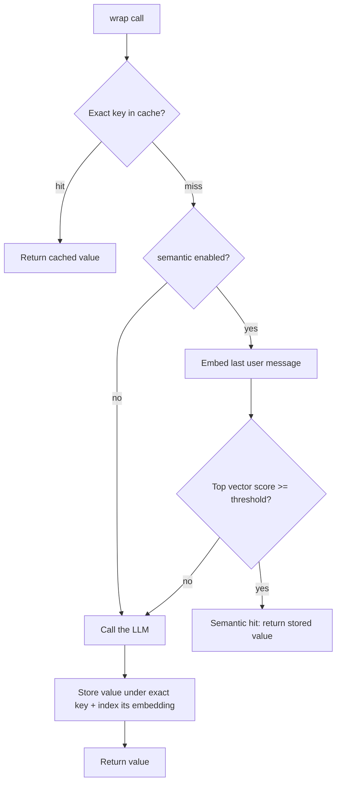

# `smart-ai-cache`


**The TypeScript-native semantic cache for LLM responses.** A two-tier cache for
OpenAI / Anthropic / Google calls: a sub-millisecond exact-match fast path, plus
an optional **semantic layer** that also serves *paraphrased* prompts — using a
local, **zero-API-key** embedding model by default.

```typescript
const cache = new AIResponseCache({ semantic: { enabled: true } });

// "How do I reset my password?" was cached earlier...
// ...this paraphrase is served from cache, no API call:
await cache.wrap(callLLM, {
  provider: 'openai', model: 'gpt-4o',
  prompt: [{ role: 'user', content: 'what are the steps to reset a password' }],
});
```

> **Why this exists:** GPTCache owns semantic caching in Python (it runs as a
> sidecar). Nothing owns idiomatic `npm install` semantic caching in TypeScript.
> That's the gap this fills — depth on the wedge, MIT, no SaaS.

---

## Table of contents

- [How it works](#how-it-works)
- [Install](#install)
- [Quick start (exact-match)](#quick-start-exact-match)
- [Semantic caching](#semantic-caching)
  - [Enable it](#enable-it)
  - [The accuracy trade-off](#the-accuracy-trade-off-the-important-part)
  - [Cost & latency honesty](#cost--latency-honesty)
  - [Embedding providers](#embedding-providers)
  - [Vector stores (single Redis)](#vector-stores-one-redis-for-everything)
  - [Tuning the threshold](#tuning-the-threshold)
- [Storage options](#storage-options)
- [Provider wrappers](#provider-wrappers)
- [Configuration](#configuration)
- [Statistics & monitoring](#statistics--monitoring)
- [Performance](#performance)
- [Architecture & extensibility](#architecture--extensibility)
- [Roadmap](#roadmap)
- [Cache management](#cache-management)
- [Error handling](#error-handling--reliability)
- [Migration guide](#migration-guide)
- [API reference](#api-reference)

---

## How it works

Two tiers behind one API. The semantic tier runs **only on an exact miss**, so
the hot path never pays an embedding cost.



1. **Exact match** — MD5 of the normalized prompt + params. Sub-millisecond. No embedding cost.
2. **Semantic match** (opt-in) — on an exact miss, embed the **last user message**, search the vector store, and return the stored response if the top cosine similarity clears `threshold`.
3. **Full miss** — call the LLM, store the value under the exact key, and index its embedding (the exact key *is* the vector id) so future paraphrases hit.

Semantic is **off by default** — adding it to an existing app is non-breaking.

---

## Install

```bash
npm install smart-ai-cache
# or: yarn add smart-ai-cache  /  pnpm add smart-ai-cache
```

The base install is exact-match only and dependency-light. Two **optional** add-ons:

```bash
# Semantic caching with the default local model (zero API key):
npx smart-ai-cache setup        # installs @xenova/transformers for you

# Redis storage (shared/persistent cache):
npm install ioredis
```

`@xenova/transformers` is an **optional peer dependency** — it is *not* pulled
into every install. You only add it (via `setup`, or manually) if you enable
semantic caching with the default local provider. If you bring your own
embeddings (e.g. OpenAI), you don't need it at all.

---

## Quick start (exact-match)

```typescript
import { AIResponseCache } from 'smart-ai-cache';
import OpenAI from 'openai';

const cache = new AIResponseCache();              // zero config
const openai = new OpenAI({ apiKey: process.env.OPENAI_API_KEY });

const ask = () =>
  openai.chat.completions.create({
    model: 'gpt-4o',
    messages: [{ role: 'user', content: 'Hello, world!' }],
  });

await cache.wrap(ask, { provider: 'openai', model: 'gpt-4o' }); // hits API
await cache.wrap(ask, { provider: 'openai', model: 'gpt-4o' }); // from cache

const stats = cache.getStats();
console.log(`Hit rate: ${stats.hitRate.toFixed(1)}%`);
```

---

## Semantic caching

Exact-match only helps when prompts are byte-for-byte identical. Real user
traffic is full of paraphrases ("reset my password" vs "how do I change my
password"). The semantic layer catches those.

### Enable it

```typescript
import { AIResponseCache } from 'smart-ai-cache';

const cache = new AIResponseCache({
  semantic: { enabled: true },   // local model + in-memory vectors, zero API key
});

// IMPORTANT: pass `prompt` so the cache has text to embed.
const result = await cache.wrap(callLLM, {
  provider: 'openai',
  model: 'gpt-4o',
  prompt: [{ role: 'user', content: 'how do I reset my password' }],
});
```

> The semantic tier embeds the **last user message only** — system prompts and
> prior history are deliberately excluded because they pollute similarity. For a
> plain string `prompt`, the whole string is embedded.

First run with the default provider downloads the model (`Xenova/all-MiniLM-L6-v2`,
384-dim, ~23 MB) from the Hugging Face hub and caches it on disk. Run
`npx smart-ai-cache setup` first if you haven't installed `@xenova/transformers`.

### The accuracy trade-off (the important part)

Semantic caching can return a **confidently wrong answer**. *"What's the capital
of France?"* and *"What's the capital of Germany?"* sit around **~0.9 cosine
similarity** with most sentence-embedding models — close enough to wrongly share
a cached answer if your threshold is too low. Set it too high and you get no
hits. This is the core failure mode, and the library is designed around it:

- **High default threshold — `0.95`.** Conservative on purpose: prefer a miss over a wrong hit.
- **Per-call / per-route override** for endpoints where you know the risk profile.
- **`logNearMisses`** surfaces queries that fell just below the line, so you tune from real traffic instead of guessing.

This is the difference between "I wrapped a vector DB" and "I understood the
failure mode."

### Cost & latency honesty

The two tiers have very different cost profiles — be clear-eyed about it:

| Path | Latency | API key | Notes |
|------|---------|---------|-------|
| Exact-match hit | **sub-millisecond** | none | unchanged fast path |
| Semantic hit (local) | **~10–50 ms warm** | none | first call is slower while the model loads (cold start) |
| Semantic hit (OpenAI provider) | network round-trip | yes | one embedding call per lookup |

So the semantic layer trades a small, real per-lookup cost for catching
paraphrases the exact path would miss. Whether that's a win depends on your
traffic — measure it (see [Statistics](#statistics--monitoring)).

### Embedding providers

```typescript
import {
  AIResponseCache,
  LocalEmbeddingProvider,   // default — local, zero API key
  OpenAIEmbeddingProvider,  // opt-in — higher quality, needs a key
} from 'smart-ai-cache';

// Default (implicit):
new AIResponseCache({ semantic: { enabled: true } });

// Pick a different local model:
new AIResponseCache({
  semantic: { enabled: true, model: 'Xenova/all-MiniLM-L12-v2' },
});

// Use OpenAI embeddings (no @xenova/transformers needed):
new AIResponseCache({
  semantic: {
    enabled: true,
    provider: new OpenAIEmbeddingProvider({ apiKey: process.env.OPENAI_API_KEY }),
  },
});
```

Bring your own by implementing the interface:

```typescript
import { EmbeddingProvider } from 'smart-ai-cache';

class MyEmbeddings implements EmbeddingProvider {
  readonly id = 'my-embeddings';
  async embed(text: string): Promise<number[]> {
    /* call your model, return a vector */
  }
}

new AIResponseCache({ semantic: { enabled: true, provider: new MyEmbeddings() } });
```

### Vector stores (one Redis for everything)

The vector store is auto-selected to match your `storage` backend, so you never
run two databases:

| `storage` | Default vector store | What it means |
|-----------|----------------------|----------------|
| `'memory'` (default) | `MemoryVectorStore` | in-process, brute-force cosine |
| `'redis'` | `RedisVectorStore` | **the same plain Redis** as the exact-match cache |

`RedisVectorStore` uses **plain Redis** — vectors live in a single Redis hash and
cosine is computed in Node. **No Redis Stack / RediSearch module required.** One
ordinary Redis server (e.g. `redis:7-alpine`) backs both tiers:

```typescript
const cache = new AIResponseCache({
  storage: 'redis',
  redisOptions: { host: 'localhost', port: 6379 },
  semantic: { enabled: true },   // vectors persist in the same Redis, shared across instances
});
```

It's brute-force (O(n) per lookup), which is fine for cache-sized working sets;
swap in a native index later via the `VectorStore` interface if you outgrow it.

### Tuning the threshold

```typescript
const cache = new AIResponseCache({
  semantic: {
    enabled: true,
    threshold: 0.95,        // global default
    topK: 1,                // neighbours fetched per lookup
    logNearMisses: true,    // log scores that fell just under threshold
  },
});

// Per-call override — e.g. a stricter bar for a high-stakes route:
await cache.wrap(callLLM, {
  provider: 'openai', model: 'gpt-4o',
  prompt: messages,
  semantic: { threshold: 0.97 },
});

// Or disable semantic for one call even when globally on:
await cache.wrap(callLLM, {
  provider: 'openai', model: 'gpt-4o', prompt: messages,
  semantic: { enabled: false },
});
```

Turn on `logNearMisses`, watch `getStats().nearMisses` and the debug logs on
real traffic, then lower/raise `threshold` deliberately.

---

## Storage options

### Memory (default)

```typescript
const cache = new AIResponseCache({
  storage: 'memory',   // default
  maxSize: 1000,       // LRU eviction beyond this
  ttl: 3600,           // seconds
});
```

Fastest possible; not shared across instances; lost on restart.

### Redis

```typescript
const cache = new AIResponseCache({
  storage: 'redis',
  redisOptions: { host: 'localhost', port: 6379, password: process.env.REDIS_PASSWORD },
  keyPrefix: 'ai-cache:',
  ttl: 7200,
});
```

Persistent, shared across instances, with automatic fallback to memory if Redis
is unavailable at startup. A single plain Redis serves both the exact-match and
semantic tiers — see [Vector stores](#vector-stores-one-redis-for-everything).

```yaml
# docker-compose.yml — plain Redis is all you need
services:
  redis:
    image: redis:7-alpine
    ports: ["6379:6379"]
    command: redis-server --appendonly yes
    volumes: [redis_data:/data]
volumes:
  redis_data:
```

---

## Provider wrappers

Typed wrappers per provider, with automatic token/cost tracking. They inherit
the full config above (including `semantic`).

### OpenAI

```typescript
import { OpenAICache } from 'smart-ai-cache';

const cache = new OpenAICache({ storage: 'redis', redisOptions: { host: 'localhost', port: 6379 } });

const res = await cache.chatCompletion({
  model: 'gpt-4o',
  messages: [
    { role: 'system', content: 'You are a helpful assistant.' },
    { role: 'user', content: 'Explain quantum computing simply' },
  ],
});
console.log(res.choices[0].message.content);
```

### Anthropic Claude

```typescript
import { AnthropicCache } from 'smart-ai-cache';

const cache = new AnthropicCache({ storage: 'memory' });
const res = await cache.messages({
  model: 'claude-3-5-sonnet-20241022',
  max_tokens: 1000,
  messages: [{ role: 'user', content: 'Write a fibonacci function in Python' }],
});
console.log(res.content[0].text);
```

### Google Gemini

```typescript
import { GoogleCache } from 'smart-ai-cache';

const cache = new GoogleCache({ storage: 'redis' }, process.env.GOOGLE_API_KEY);
const res = await cache.generateContent(
  { contents: [{ role: 'user', parts: [{ text: 'Benefits of renewable energy?' }] }] },
  'gemini-1.5-pro',
);
console.log(res.response.text());
```

---

## Configuration

```typescript
interface CacheConfig {
  ttl?: number;                 // seconds (default: 3600)
  maxSize?: number;             // memory LRU cap (default: 1000)
  storage?: 'memory' | 'redis'; // default: 'memory'
  redisOptions?: RedisOptions;  // ioredis options
  keyPrefix?: string;           // default: 'ai-cache:'
  enableStats?: boolean;        // default: true
  debug?: boolean;              // default: false
  semantic?: SemanticConfig;    // default: { enabled: false }
}

interface SemanticConfig {
  enabled: boolean;             // default: false (backward compatible)
  provider?: EmbeddingProvider; // default: LocalEmbeddingProvider
  vectorStore?: VectorStore;    // default: Memory, or Redis when storage='redis'
  threshold?: number;           // cosine similarity for a hit (default: 0.95)
  topK?: number;                // neighbours per lookup (default: 1)
  model?: string;               // local model id (default: 'Xenova/all-MiniLM-L6-v2')
  logNearMisses?: boolean;      // log sub-threshold matches (default: false)
}
```

---

## Statistics & monitoring

```typescript
const stats = cache.getStats();

console.log(`Total requests : ${stats.totalRequests}`);
console.log(`Cache hits     : ${stats.cacheHits} (${stats.hitRate.toFixed(1)}%)`);
console.log(`  of which semantic: ${stats.semanticHits}`);
console.log(`Near-misses    : ${stats.nearMisses}`);   // when logNearMisses is on
console.log(`Cost saved     : $${stats.totalCostSaved.toFixed(4)}`);
console.log(`Avg response   : ${stats.averageResponseTime.toFixed(2)} ms`);

for (const [provider, p] of Object.entries(stats.byProvider)) {
  console.log(`${provider}: ${p.hits}/${p.requests} hits, $${p.costSaved.toFixed(4)} saved`);
}

cache.resetStats();
```

**Measuring savings honestly:** how much you save depends entirely on how
repetitive and paraphrased your traffic is — there's no universal percentage.
Exact duplicates avoid 100% of the repeat call; the semantic layer additionally
catches paraphrases above your threshold. Use `semanticHits` / `hitRate` on a
representative, paraphrase-heavy slice of your real traffic to get your number.

---

## Performance

Two commands, reproducible in your own environment:

```bash
npm run benchmark            # exact-match path (memory, throughput, eviction)
npm run benchmark:semantic   # semantic vs non-semantic (needs the local model)
```

### Semantic vs non-semantic

Measured locally with the default `Xenova/all-MiniLM-L6-v2` (384-dim) on an Apple
Silicon laptop / Node 22, averaged over 200 lookups. **Your numbers will vary** —
run it yourself.

| Operation | Latency | Notes |
|-----------|---------|-------|
| Exact-match hit | **~0.012 ms** (~12 µs) | non-semantic fast path (incl. key hashing) |
| Vector search only (1k entries) | ~1.1 ms | in-memory brute-force cosine |
| Embedding only (local, warm) | ~3 ms | per lookup |
| **Semantic lookup** (embed + search) | **~6 ms** | added cost on the semantic path |
| Cold start (first call) | ~0.3 s | loading the on-disk model; **first-ever run downloads ~23 MB (several seconds)** |

The exact-match path is **~500x faster** than the semantic path — but only the
semantic path catches paraphrases. Both replace a full LLM round-trip (typically
hundreds of ms to seconds), so a semantic hit at ~6 ms is still a large win over
a real API call.

### Reality check on similarity scores

In the benchmark, two genuine paraphrases —

> *"How do I reset my password?"* vs *"what are the steps to change my password"*

— score a cosine similarity of **0.805**. That's **below the 0.95 default
threshold**, so it would *not* hit out of the box. This is intentional: the
default errs against false hits. Real paraphrases often land in the 0.75–0.90
range, so **tune `threshold` on your own traffic** (use `logNearMisses`) rather
than trusting a generic number. See [the accuracy trade-off](#the-accuracy-trade-off-the-important-part).

---

## Architecture & extensibility

Every tier is a small, swappable interface — bring your own implementation:

```typescript
interface StorageInterface {            // exact-match storage
  get(key): Promise<CacheEntry | null>;
  set(key, entry): Promise<void>;
  delete(key): Promise<boolean>;
  clear(): Promise<void>;
  has(key): Promise<boolean>;
  size(): Promise<number>;
  keys(): Promise<string[]>;
}

interface EmbeddingProvider {           // text -> vector
  readonly id: string;
  embed(text: string): Promise<number[]>;
}

interface VectorStore {                 // nearest-neighbour search
  add(id, vector, meta?): Promise<void>;
  search(vector, topK): Promise<{ id: string; score: number }[]>;
  delete(id): Promise<void>;
  clear(): Promise<void>;
  size(): Promise<number>;
}
```

Bundled implementations: `MemoryStorage` / `RedisStorage`,
`LocalEmbeddingProvider` / `OpenAIEmbeddingProvider` / `MockEmbeddingProvider`,
`MemoryVectorStore` / `RedisVectorStore`. `MockEmbeddingProvider` and
`cosineSimilarity` are exported so your own tests stay deterministic and never
download a model.

---

## Roadmap

| Phase | Scope | Status |
|------:|-------|--------|
| **1** | Semantic layer over the exact-match core | ✅ shipped |
| **2** | Vercel AI SDK adapter | planned |
| **3** | Tool-result + session-state cache tiers | planned |
| **4** | OpenTelemetry (spans + metrics) | planned |


---

## Cache management

```typescript
await cache.getCacheSize();
await cache.deleteByPattern('*openai:gpt-4o:*');  // wildcard invalidation
await cache.clear();                              // clears values AND semantic vectors
await cache.delete(cache.generateKey('openai', 'gpt-4o', prompt, params));
await cache.has(key);

// Graceful shutdown — closes Redis (storage + vector store) connections:
process.on('SIGTERM', async () => {
  await cache.disconnect();
  process.exit(0);
});
```

---

## Error handling & reliability

- Automatic retries with exponential backoff (3 attempts) on the wrapped call.
- Graceful degradation: cache get/set errors fall through to the LLM rather than failing the request.
- Semantic lookup errors (embedding/search) fall through to a normal miss — semantic never breaks a request.
- Redis startup failure falls back to in-memory storage.

```typescript
try {
  const res = await cache.wrap(apiCall, options);
} catch (error) {
  // only thrown if the underlying LLM call fails after all retries
}
```

---

## Migration guide

### Adding semantic caching to an existing app

It's additive and **non-breaking** — semantic is off until you opt in:

```typescript
// before
const cache = new AIResponseCache({ storage: 'redis', redisOptions });

// after — same Redis, now catches paraphrases
const cache = new AIResponseCache({ storage: 'redis', redisOptions, semantic: { enabled: true } });
```
Then run `npx smart-ai-cache setup` once (for the default local model), and make
sure you pass `prompt` to `wrap()` so there's text to embed.

### From v1.0.4 to v1.0.5+

- Cache methods became async: `clear()`, `delete()`, `has()`, `getCacheSize()` — add `await`.
- Provider classes no longer take a client instance: `new OpenAICache(config)`.

---

## API reference

**Classes**
`AIResponseCache` · `OpenAICache` · `AnthropicCache` · `GoogleCache` ·
`MemoryStorage` · `RedisStorage` · `LocalEmbeddingProvider` ·
`OpenAIEmbeddingProvider` · `MockEmbeddingProvider` · `MemoryVectorStore` ·
`RedisVectorStore`

**Helpers / types**
`cosineSimilarity` · `EmbeddingProvider` · `VectorStore` · `VectorSearchResult` ·
`StorageInterface` · `CacheConfig` · `SemanticConfig` · `CacheStats`

**Key methods**
`wrap(fn, options)` · `getStats()` · `resetStats()` · `clear()` · `delete(key)` ·
`deleteByPattern(pattern)` · `has(key)` · `getCacheSize()` · `disconnect()`

**CLI**
`npx smart-ai-cache setup` — install the local embedding model ·
`npx smart-ai-cache help`

Full generated docs: [TypeDoc](https://archiesdubey.github.io/smart-ai-cache/).

---

## Contributing

1. Fork & branch (`git checkout -b feature/x`)
2. `npm test` (deterministic — `MockEmbeddingProvider` keeps CI model-free)
3. `npm run benchmark`
4. Open a PR

## License

MIT — see [LICENSE](LICENSE).

---

**Made with ❤️ for the AI developer community**

[⭐ Star on GitHub](https://github.com/ArchiesDubey/smart-ai-cache) · [Docs](https://archiesdubey.github.io/smart-ai-cache/) · [Issues](https://github.com/ArchiesDubey/smart-ai-cache/issues)
